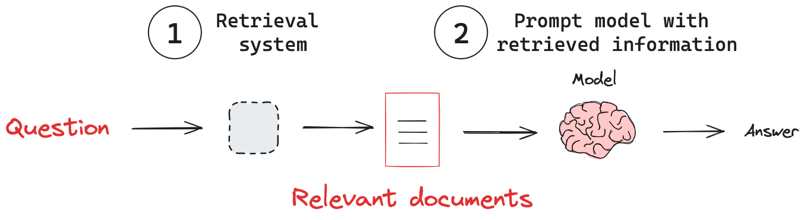
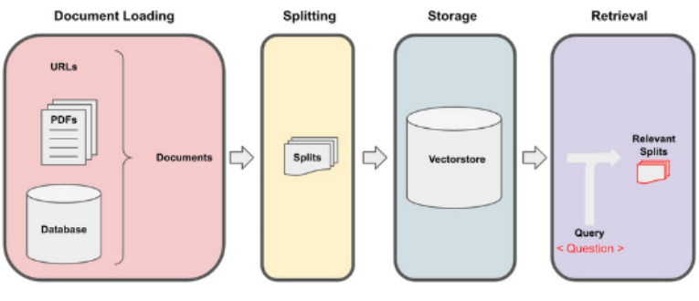

<!--  Nombre de la Unidad __
-->

# Unidad 3: Proyecto Integtrador. Construcción y depliegue de un sisitema RAG
<!--
Introducción a la unidad
Teniendo en cuenta que cada unidad es un saber específico, en la introducción se destaca la importancia y relevancia del saber que se abordará en función de los resultados de aprendizaje planteados. Describe brevemente cómo el tema central de la unidad se integra en el panorama más amplio del aprendizaje y de la vida cotidiana o profesional del estudiante. Su propósito es despertar la curiosidad y el interés del estudiante sobre los contenidos que explorará.

En definitiva, se trata de responder a las preguntas: ¿Qué va a aprender el estudiante? ¿Cómo lo va a aprender? ¿Para qué lo va a aprender?  

Recomendaciones:
Inicia presentando al estudiante cómo se relaciona el conocimiento de la unidad con su contexto. 
Incluye el propósito de la unidad y lo que el estudiante aprenderá mediante su estudio.
Vale la pena destacar algunos de los temas más importantes que se abordarán.
Procura no superar las 300 palabras (1500 caracteres) al redactar la introducción.
-->

## Introducción a la unidad

Bienvenodos a la última unidad de nuestro curso sobre aplicacionea asistidas por LLMs. En esta unidad aperndereos sobre dument loaders y deplegaremos una aplicación Rag funcional para conversar con alrchivos en pdf.

<!-- Resultados de aprendizaje
Los objetos de aprendizaje se asumen como aquello que los estudiantes serán capaces de hacer a partir de lo que aprendieron a lo largo de la unidad.

Recomendaciones:
Formula máximo dos resultados por unidad. 
Asegúrate que tengan relación con los objetivos de aprendizaje planteados en la carta descriptiva. 
Redacta los resultados a partir de tres elementos: qué, cómo y para qué.
Recuerda que los resultados se establecen en función del aprendizaje, no de la enseñanza. 
Utiliza verbos conjugados en presente (describen la acción).  
Los resultados deben ser medibles y alcanzables. 

-->

## Cronograma de actividades - Unidad 1
| Actividad de aprendizaje       | Evidencia de aprendizaje | Semana       | Ponderación |
|--------------------------------|---------------------------|--------------|--------------|
| Reto Formativo 1 y 2           | EA1:  Templates y Output Parsers | Semana 1, 2 y 3 | 25%         |
| **Total**                      |                           |              | **25 %**     |

<!--
Desarrollo temático
Aquí comienza la elaboración del contenido que hará parte de la unidad temática. Para ello, es preciso identificar qué requiere el estudiante para aprender y comprender aquello que debe explorar, desarrollar nuevas habilidades, aplicar el conocimiento y cumplir con los resultados de aprendizaje. 

Los textos se construyen con cohesión y claridad, de manera que facilite al estudiante apropiarse del conocimiento de manera efectiva. Esta elaboración debe estar respaldada por enfoques didácticos, garantizando un proceso de aprendizaje sólido y bien fundamentado.

Recomendaciones:
Ten en cuenta las siguientes recomendaciones para desarrollar las temáticas de la actividad de aprendizaje:
Lee el documento “Manual del contenidista” en el cual encontrarás consejos para redactar los contenidos.
Ten a la mano el “Manual de redacción” para resolver dudas o inquietudes sobre el uso de las normas APA para citas y referencias. 
Cada unidad debe tener una cantidad mínima de 30 páginas de contenido temático. Esto equivale aproximadamente a 8500 palabras, en Arial 12, espaciado 1.0 y texto justificado. 
El desarrollo del contenido requiere un 70 % de producción propia y un 30 % para contenidos de terceros (fuentes primarias). Monitorea permanentemente tu documento con ayuda de la herramienta Turnitin para revisar el porcentaje de similitud.
Los textos e imágenes de terceros obligatoriamente se deben citar y referenciar, procurando que no superen el porcentaje exigido (30 %). Debes suministrar los enlaces de los recursos digitales empleados (PDF, sitios web, artículos online, videos, imágenes, etc.). Todos estos recursos deben ser de uso libre.
No incluir artículos, tesis, textos o documentos propios que han sido previamente publicados o presentados a otra institución. 
Los recursos como imágenes, infografías, ilustraciones, tablas, etc., no hacen parte de las 30 páginas del desarrollo de contenido.
Las figuras propias deben ser editables y se entregan en una carpeta aparte, cuidando que tengan el nombre y número correspondiente. 
Las fuentes se pueden tomar de bases de datos de suscripción como EBSCO o de uso libre como Redalyc y Google Académico, las cuales cuentas con licencia Creative Commons (LCC) para su reproducción (solicitar el acceso a los repositorios en caso de no tenerlo).
Organiza y jerarquiza los temas y subtemas numéricamente.

-->

<!-- Your content for this section goes here -->

## Retival Aumented generation (RAG)

El desempeño de un modelo de lenguaje en un tópico particular depende de cuánto haya visto datos sobre este tópico en su proceso de entrenamiento. Si un tema no aparece mucho en internet, el modelo tiene una capacidad limitada para responder preguntas sobre este, mientras que si este tema es muy bien difundido, el desempeño del modelo en este tipo de temas será mucho mejor. Por otro lado, existe información que el modelo nunca vio, por ejemplo, los contratos de compraventa de una empresa que se dedica a la venta de casas, los decretos y ordenanzas que los gobiernos emitieron después de la última actualización del modelo, etc.

En una RAG, un LLM recupera documentos contextuales a partir de una base de datos externa como parte de su ejecución. Esto es útil si queremos hacer preguntas sobre documentos específicos. La figura muestra el esquema general de una aplicación RAG.

{ width=" " }
*Esquema de flujo de una aplicación RAG. Fuente: [LangChain Documentation](https://python.langchain.com/docs/concepts/rag/).*

Retrival, es el sisetema que dadao una solicititud devuelve los docuemtnos relevantes para que el LMM elabore la respuesta. Este sistema tiene acoplado 3 subsitemas:
Document Loader: Carga documentos desde diversas fuentes (archivos locales, sitios web, bases de datos, etc.).

Text Splitter: Divide los documentos en fragmentos manejables para su procesamiento.

Vector Store: Almacena representaciones vectoriales de los documentos para una recuperación eficiente.

La Figura 2 ilustra cómo estos subsistemas interactúan en el pipeline de RAG:
alt text

*& genera la legenda & Fuente: & crea el link a el curso chat wit your datda de depp learnig ai &.*

### Document Loaders

